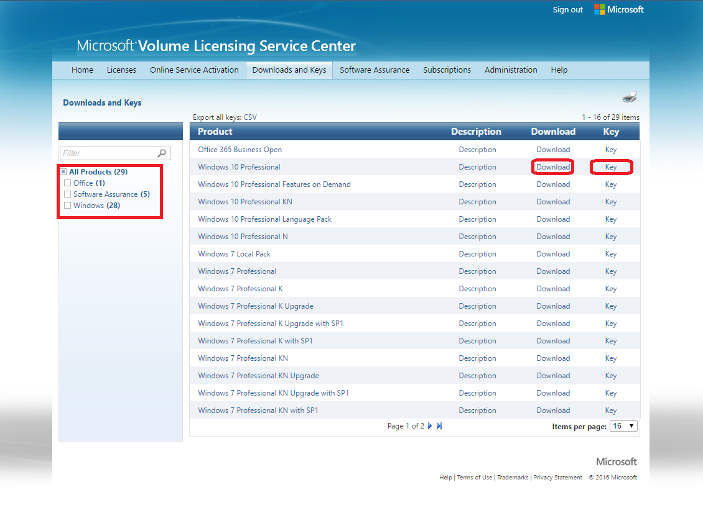
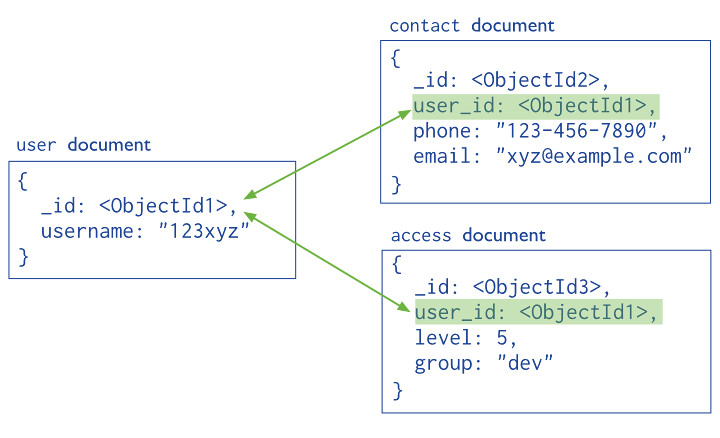

# Databases
| First Header  | Second Header |
| ------------- | ------------- |
|  SQL databases are primarily called as Relational Databases (RDBMS) |   NoSQL database are primarily called as non-relational or distributed database. |
|  SQL databases have predefined schema  | NoSQL databases have dynamic schema for unstructured data.   |
| SQL database examples: MySql, Oracle, Sqlite, Postgres and MS-SQL  | NoSQL database examples: MongoDB, BigTable, Redis, RavenDb, Cassandra, Hbase, Neo4j and CouchDb |
|  For properties: SQL databases emphasizes on ACID properties ( Atomicity, Consistency, Isolation and Durability)  | the NoSQL database follows the Brewers CAP theorem ( Consistency, Availability and Partition tolerance ) |
|  For the type of data to be stored: SQL databases are not best fit for hierarchical data storage.  |  NoSQL database fits better for the hierarchical data storage as it follows the key-value pair way of storing data similar to JSON data.   |

2- What kind of data is a good fit for an SQL database?

relational data big data that require complex queries.

3- Give a real world example.

4- What kind of data is a good fit a NoSQL database?

hierarchical data

5- Give a real world example.

6- Which type of database is best for hierarchical data storage? 
NoSQL database

7- Which type of database is best for scalability? SQL database

# mongoose api

1- What does SQL stand for?

Structured Query Language

2- What is a realational database?

database that stores and provides access to data points that are related to one another they are based on the relational model, and represent data in tables

3- What type of structure does a relational database work with?

in general data is structured as a set of tables and manipulated in accordance with the relational model of data. in each data base there is :
a set of system catalog tables
a configuration file containing the parameter values
a recovery log
4- What is a ‘schema’?

its a collection of database objects*
5- What is a NoSQL database?

non-relational Data Management System, that does not require a fixed schema

6- Howo does it work?

NoSQL databases store data in documents rather than relational tables in a key-value

7- What is inside of a Mongo database?

collections contain a sets of documents which consist data of key-value pairs

8- Which is more flexible - SQL or MongoDB? and why. MongoDB

9- What is the disadvantage of a NoSQL database?

Not Mature.
Less Support.
do not fit with legacy systems with old characteristics.