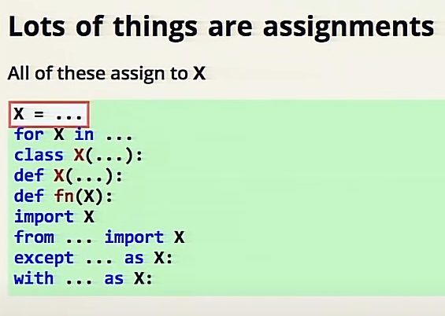

# _*A friendly intro to Big O Notation*_

### the big O notation is to measure the complexity of an algorithm

the best algorithm is O(1)
and it keeps getting more complex from there for example O(n),O(n^2),O(2^n)
and the last one is the worst algorithm when it comes to complexity

# *_Names and Values in Python_*
<ol>
<li> numbers : n=7 
<li> string : n="hello world"
<li> tuples : n=(5,11,"osama")
<li> floats : n=3.14
<li> list : n= [4,"osama",2.4]
<li> dectionary : n= {1:5,2:6,3:7,"key":"value"}
</ol>
mutable aliases have mutable value , can have more than one name ,
and you can change the value too.

you can assign many things to one variable.

for loops : for x in sequence : something (x)

# *_Awesome Python Environment_*

tools that you can use :

The Interpreter is the most important thing when working with python and if you have  programs that require different python versions or programs that depend on different versions of the same third-party module and you want to switch between those programs Pyenv will help you pyenv is a set of three tools, from which I present two here <ol>
<li> pyenv
<li> pyenv-virtualenv
</ol>

# *_Python Module of the Week_*

Text
<ol>
<li>string — Text Constants and Templates
<li>textwrap — Formatting Text Paragraphs
</ol>

Data Structures

<ol>
<li>enum – Enumeration Type
<li>collections — Container Data Types
<li>array — Sequence of Fixed-type Data

<li>heapq – Heap Sort Algorithm
<li>bisect — Maintain Lists in Sorted Order
</ol>

Algorithms
<ol>
<li>functools — Tools for Manipulating Functions
<li>itertools — Iterator Functions

<li>operator — Functional Interface to Built-in Operators

<li>contextlib — Context Manager Utilities

</ol>

