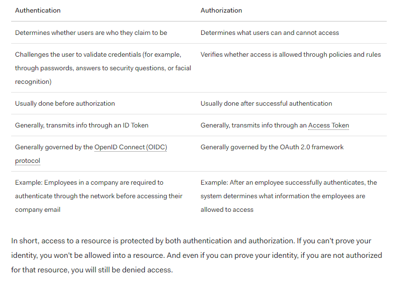

Code401# What is OAuth

1- What is OAuth?
is an open-standard authorization protocol or framework that describes how unrelated servers and services can safely allow authenticated access to their assets without actually sharing the initial, related, single logon credential

2- Give an example of what using OAuth would look like.
login/signup with google account on canvas

3- How does OAuth work? What are the steps that it takes to authenticate the user?<ul><li>The first website connects to the second website on behalf of the user, using OAuth, providing the user’s verified identity.
</li><li>The second site generates a one-time token and a one-time secret unique to the transaction and parties involved.</li><li>The first site gives this token and secret to the initiating user’s client software</li><li>The client’s software presents the request token and secret to their authorization provider (which may or may not be the second site).
</li><li>If not already authenticated to the authorization provider, the client may be asked to authenticate. After authentication, the client is asked to approve the authorization transaction to the second website.</li><li>The user approves (or their software silently approves) a particular transaction type at the first website.</li><li>The user is given an approved access token (notice it’s no longer a request token).</li><li>The user gives the approved access token to the first website.</li><li>The first website gives the access token to the second website as proof of authentication on behalf of the user.</li><li>The second website lets the first website access their site on behalf of the user.</li><li>The user sees a successfully completed transaction occurring.</li><li>OAuth is not the first authentication/authorization system to work this way on behalf of the end-user. In fact, many authentication systems, notably Kerberos, work similarly. What is special about OAuth is its ability to work across the web and its wide adoption. It succeeded with adoption rates where previous attempts failed (for various reasons).</li>

</ul>

What is OpenID?
human verification / to check for bots

# Authorization and Authentication flows

1- What is the difference between authorization and authentication?

2- What is Authorization Code Flow?

3- What is Authorization Code Flow with Proof Key for Code Exchange (PKCE)?

4- What is Implicit Flow with Form Post?

5- What is Client Credentials Flow?

With machine-to-machine (M2M) applications, such as CLIs, daemons, or services running on your back-end, the system authenticates and authorizes the app rather than a user. For this scenario, typical authentication schemes like username + password or social logins don't make sense. Instead, M2M apps use the Client Credentials Flow, in which they pass along their Client ID and Client Secret to authenticate themselves and get a token.

6- What is Device Authorization Flow?  
With input-constrained devices that connect to the internet, rather than authenticate the user directly, the device asks the user to go to a link on their computer or smartphone and authorize the device. This avoids a poor user experience for devices that do not have an easy way to enter text.

7- What is Resource Owner Password Flow?

Though we do not recommend it, highly-trusted applications can use the Resource Owner Password Flow , which requests that users provide credentials (username and password), typically using an interactive form. Because credentials are sent to the backend and can be stored for future use before being exchanged for an Access Token, it is imperative that the application is absolutely trusted with this information.
